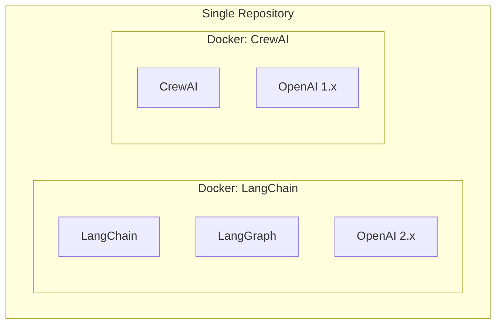

# AI Agents Portfolio

A portfolio project demonstrating AI agent development using **LangChain/LangGraph** and **CrewAI** frameworks.

## Overview

This project showcases two popular AI agent frameworks running in isolated Docker environments to avoid dependency conflicts.



## Features

- **LangChain/LangGraph**: Modern agent workflows with OpenAI 2.x
- **CrewAI**: Multi-agent orchestration with role-based agents
- **Docker isolation**: Each framework runs in its own container
- **Shared infrastructure**: Single CI/CD, documentation, and tooling

## Quick Start

```bash
# Clone repository
git clone https://github.com/hcslomeu/ai-agents.git
cd ai-agents

# Build Docker images
docker compose build

# Run LangChain examples
docker compose run --rm langchain python src/langchain_examples/script.py

# Run CrewAI examples
docker compose run --rm crewai python src/crewai_examples/script.py
```

## Why This Architecture?

This project uses a **monorepo with dual Docker environments** instead of separate repositories. This decision has trade-offs documented in the [Architecture Decision](architecture-decision.md) page.

**TL;DR**: The added CI/CD complexity is worth it for a unified portfolio that demonstrates Docker skills and architectural decision-making.
